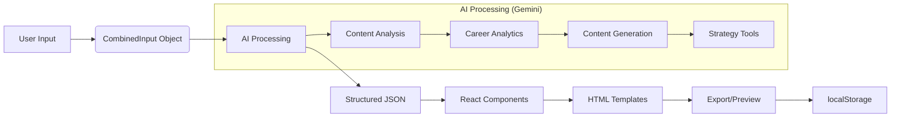

# ResumeAI Builder


A sophisticated AI-powered resume builder that transforms unstructured data into professional, ATS-optimized career documents with deep analytics and strategic insights.

## 🚀 Live Demo
[Coming Soon] - Deploy via Vercel/Netlify

## ✨ Features

### 🤖 AI-Powered Career Suite
- **Smart Resume Generation**: Transform text, files, or GitHub data into polished resumes
- **Deep Analytics**: Tone analysis, grammar scoring (0-100), employment gap detection
- **Content Variations**: Three tailored summaries (Creative, Corporate, Technical)
- **Strategic Insights**: Market salary ranges, certification recommendations, role matching

### 📊 Multi-Source Data Ingestion
- **GitHub Integration**: Import repositories, languages, stars, and README analysis
- **Text Input**: Raw text parsing for existing resume content
- **File Upload**: Support for PDF and TXT files
- **Job Targeting**: Customize content for specific job descriptions

### 🎨 Advanced Customization
- **20+ Visual Templates**: Executive, Elegant, Modern, Creative, Minimal, Timeline, Grid, Tech, and more
- **Typography Control**: 7 font families (Sans, Serif, Mono, Display, Slab, Oswald, Lato)
- **Color Themes**: 8 accent colors (Cyan, Black, Red, Green, Orange, Purple, Pink, White)
- **View Modes**: Resume and Cover Letter previews

### 📤 Export & Outreach
- **PDF Export**: Browser-native printing with optimized CSS
- **DOCX Download**: Microsoft Word compatible documents
- **Outreach Kit**: Cold emails, LinkedIn posts, Twitter bios, GitHub README snippets

## 🛠 Technology Stack

| Technology | Purpose |
|------------|---------|
| **React 19** | Frontend framework with functional components & hooks |
| **TypeScript** | Strict typing for all interfaces and data structures |
| **Tailwind CSS** | Utility-first styling with custom configurations |
| **Google Gemini API** | AI engine (gemini-2.5-flash model) for content generation |
| **html-docx-js-typescript** | DOCX document generation |
| **file-saver** | Client-side file saving |

## 📁 Project Structure

```
resumeai-builder/
├── src/
│   ├── components/          # React components
│   │   ├── builder/        # Builder interface components
│   │   ├── preview/        # Resume preview components
│   │   ├── inputs/         # Data ingestion components
│   │   └── ui/             # Reusable UI components
│   ├── hooks/              # Custom React hooks
│   ├── services/           # API and external service integrations
│   ├── types/              # TypeScript interfaces
│   ├── templates/          # Resume template definitions
│   ├── utils/              # Utility functions
│   └── styles/             # Tailwind and custom CSS
├── public/
│   ├── index.html
│   └── assets/             # Icons, images, etc.
└── package.json
```

## 🚦 Getting Started

### Prerequisites
- Node.js 18+ 
- npm or yarn
- Google Gemini API key

### Installation

1. **Clone the repository**
```bash
git clone https://github.com/yourusername/resumeai-builder.git
cd resumeai-builder
```

2. **Install dependencies**
```bash
npm install
# or
yarn install
```

3. **Set up environment variables**
Create a `.env.local` file:
```env
VITE_GEMINI_API_KEY=your_google_gemini_api_key_here
```

4. **Start the development server**
```bash
npm run dev
# or
yarn dev
```

5. **Open your browser**
Navigate to `http://localhost:5173`

## 🔧 Configuration

### AI Integration
The app uses Google Gemini API. Get your API key from [Google AI Studio](https://makersuite.google.com/app/apikey).

### Storage
All data is stored locally in `localStorage` with the key `resumeData_v4`. No backend database is required.

### Custom Templates
Add new templates in `src/templates/` following the existing structure:
```typescript
interface TemplateConfig {
  id: string;
  name: string;
  category: 'core' | 'advanced';
  component: React.ComponentType;
  previewColors: string[];
}
```

## 📖 Usage Guide

### 1. Data Input
- **Option A**: Paste your resume text into the text area
- **Option B**: Upload PDF/TXT files
- **Option C**: Connect GitHub account for repository analysis
- **Option D**: Add target job description for customization

### 2. AI Generation
Click "Generate Career Suite" to process your data. The AI will:
- Parse and structure your information
- Generate multiple summary variations
- Provide career analytics and suggestions
- Create outreach content

### 3. Customization
- Select from 20+ templates
- Adjust typography and colors
- Toggle between resume and cover letter views
- Edit any field directly

### 4. Export
- **Print to PDF**: Uses browser print with optimized styling
- **Download DOCX**: Generates Microsoft Word document
- **Copy Outreach Content**: Direct copy buttons for emails and social posts

## 🎯 Data Flow Architecture



## 🔐 Privacy & Security

- **Local Storage**: All data persists only in your browser
- **API Calls**: Data sent to Gemini API but not stored by us
- **No Backend**: Zero server-side data storage
- **Transparent Processing**: Clear indication when data leaves your device

## ⚡ Performance

- **Initial Load**: < 3 seconds
- **AI Processing**: 5-15 seconds (depends on input size)
- **Export Generation**: < 2 seconds
- **Bundle Size**: ~150KB gzipped

## 🐛 Troubleshooting

### Common Issues

1. **API Key Errors**
   - Ensure your Gemini API key is valid
   - Check browser console for authentication errors

2. **PDF Upload Issues**
   - PDF parsing relies on text extraction
   - Complex formatting may require manual text input

3. **Export Formatting**
   - Use Chrome/Firefox for best PDF results
   - DOCX export may have limited styling support

4. **GitHub Rate Limiting**
   - Unauthenticated API calls have rate limits
   - Consider adding personal access token for higher limits

### Browser Support
- Chrome 90+
- Firefox 88+
- Safari 14+
- Edge 90+

## 📄 License

This project is licensed under the MIT License - see the [LICENSE](LICENSE) file for details.

## 🙏 Acknowledgements

- [Google Gemini AI](https://deepmind.google/technologies/gemini/)
- [Tailwind CSS](https://tailwindcss.com/)
- [React](https://reactjs.org/)
- [Vite](https://vitejs.dev/)

## 🤝 Contributing

1. Fork the repository
2. Create a feature branch (`git checkout -b feature/AmazingFeature`)
3. Commit changes (`git commit -m 'Add AmazingFeature'`)
4. Push to branch (`git push origin feature/AmazingFeature`)
5. Open a Pull Request

## 📞 Support

For support, feature requests, or bug reports:
1. Check existing [Issues](https://github.com/yourusername/resumeai-builder/issues)
2. Create a new issue with detailed description
3. Email: support@resumeai.example.com

---

**Built with ❤️ for job seekers worldwide.** Automate your career growth with AI-powered insights and professional documentation.
